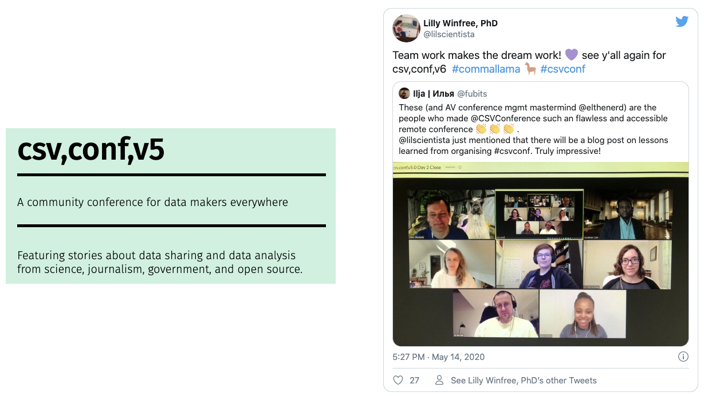
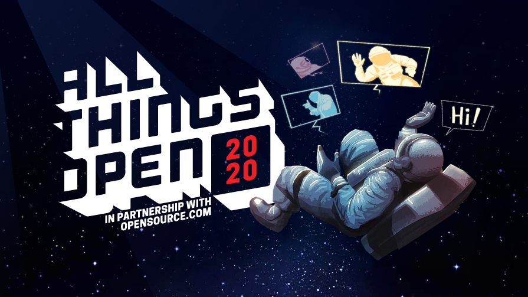
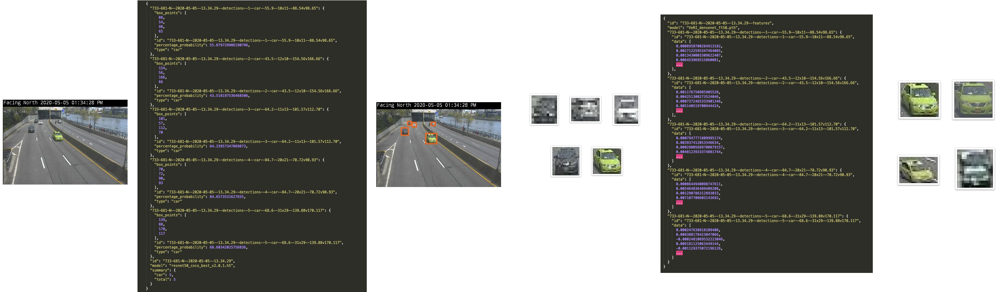
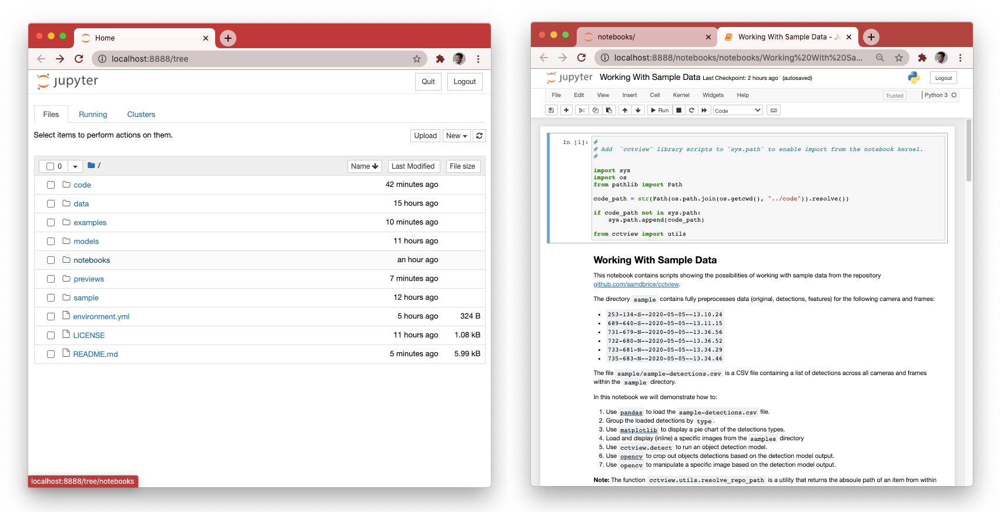
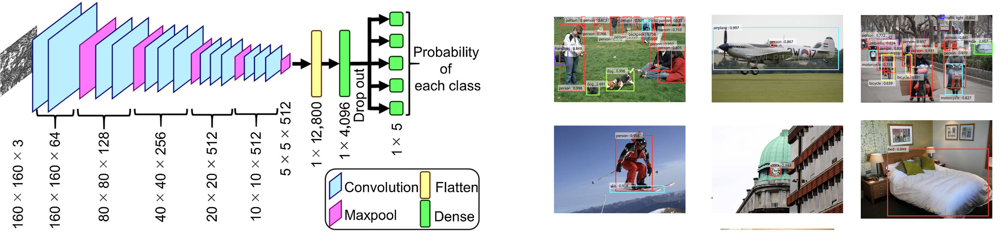
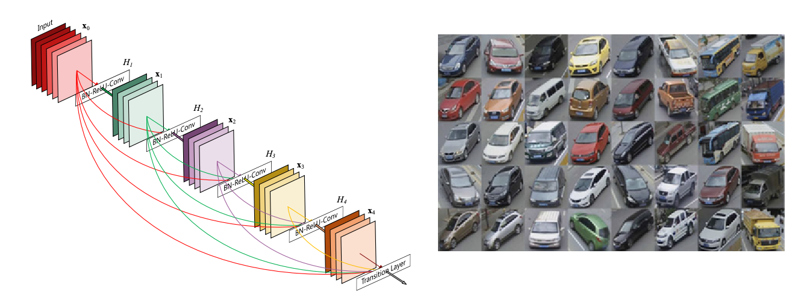

# Demystifying Clearview AI
### Vehicle Tracking with Public CCTV and Deep Learning

<p align="center">
  
  <br />
</p>

[](./LICENSE)
[](https://cctview.herokuapp.com/)

*[Demystifying Clearview AI](https://samdbrice.medium.com/fri-nov-6-2020-ae15374138b1)* is a multi-part blog series based on the namesake [csv,conf,v5](https://csvconf.com/) lightning talk. The purpose of the presentation was to demonstrate some of the technologies behind [Clearview AI](https://www.nytimes.com/2020/01/18/technology/clearview-privacy-facial-recognition.html) and, most importantly, discuss such technologies’ privacy implications. If you’re primarily interested in the higher-level privacy implications, feel free to jump to [Part 8](https://medium.com/@samdbrice/40fce44d3b0b) of the series at any time. I’d recommend carefully reading the sections starting at *[Warning: ReID Data is Personal Data.](https://medium.com/@samdbrice/40fce44d3b0b)*

Many news outlets were covering Clearview’s threat to privacy and the questionable ethics behind its methods. Still, no coverage presented the underlying technology in a very digestible way. This series aims to fill that gap and, in the process, explore some possible defenses to the privacy problems engendered by Clearview.

This repository contains fully functional demos of models, code, and other data referenced in the series.

Many thanks to the csv,conf,v5 Program Committee for accepting the talk, and to the csv,conf,v5 participants for being such a receptive and engaging audience.

<p align="center">
  <a href="https://twitter.com/lilscientista/status/1261045564281667584">
    
  </a>
</p>

**Note:** This talk was subsequently accepted to [All Things Open](https://2020.allthingsopen.org/) - the largest open technology event on the eastern seaboard!

<p align="center">
  
</p>

For 2020 ATO went virtual, transmitting world-class open source TED-style talks and workshops to 10,000+ devices worldwide.

You can check out a [recording of the talk](https://medium.com/@samdbrice/980b955b1c8c) on the All Things Open YouTube channel.

<p align="center">
  <a href="https://www.youtube.com/watch?v=oYXp29Upm-U">
    
  </a>
</p>

# Table of Contents

* [Install](#install)
* [Examples](#examples)
* [Notebooks](#notebooks)
* [Code](#code)
* [Models](#models)
* [Data](#data)
* [Repository Contents](#repository-contents)
* [CCTView Demo Application](#cctview-demo-application)

---

## Install

To run the example models, code, and notebooks clone this repository from GitHub then
create a new Conda environment based on the included ``environment.yml``.

**Requirements**:
- [``git``](https://git-scm.com/book/en/v2/Getting-Started-Installing-Git)
- [Git LFS](https://git-lfs.github.com/)
- [``conda``](https://docs.conda.io/projects/conda/en/latest/user-guide/install/)

```
git lfs install && git clone https://github.com/samdbrice/cctview.git
cd cctview
conda env create -n cctview -f environment.yml
conda activate cctview
```

**Note:** Git Large File Storage (LFS) is required to download the ``models`` state
files and the large ``data`` files.

## Examples

After installing and activating the included environment you can run the ``code/example.py`` script with ``pythonw``.

**Note**: ``pythonw`` will automatically be on your path. It's a wrapper for the ``python``
command designed to get [``matplotlib`` working correctly on OSX](https://matplotlib.org/faq/osx_framework.html).

```
pythonw code/example.py
```

The example script uses images from the ``examples`` directory to demonstrate use of
the three core modules within the ``cctview`` code package:
- [``cctview.detect``](./code/#detect)
- [``cctview.extract``](./code/#extract)
- [``cctview.match``](./code/#match)

<p align="center">
  <a href="./code">
    
  </a>
</p>

## Notebooks

After installing and activating the included environment you can start a Jupyter Notebook server
by running:

```
jupyter notebook
```

From within Jupyter navigate to the ``notebooks`` directory then open the 
[``Working With Sample Data.ipynb``](./notebooks/Working%20With%20Sample%20Data.ipynb) file.

<p align="center">
  <a href="./code">
    
  </a>
</p>

## Code

Code and other snippets discussed in the series can be found within the ``code`` directory. 
The package ``cctview`` is divided into three primary modules
- [``cctview.detect``](./code/#detect) - Object detection model.
- [``cctview.extract``](./code/#extract) - VeRI feature extraction model.
- [``cctview.match``](./code/#match) - MED calculator.

This code is not meant to be installed/imported as a proper library. It's intended to serve
as a minimalist example of the referenced models and techniques.

## Models

This repository contains two model files for ResNet ``resnet50_coco_best_v2.0.1.h5`` (146 MB) and DenseNet ``VeRI_densenet_ft50.pth`` (74 MB) architectures used in object detection and Vehicle-ReID, respectively.

```
models
├── [146M]  resnet50_coco_best_v2.0.1.h5
└── [ 74M]  VeRI_densenet_ft50.pth
```

### Residual Network (ResNet)

The 50-layer ResNet model stored within ``resnet50_coco_best_v2.0.1.h5`` comes from the 
[``RetinaNet``](https://imageai.readthedocs.io/en/latest/detection/index.html) pre-trained options 
within `ImageAI`. It has been trained on the [COCO dataset](http://cocodataset.org/#home).

The module [``cctview.detect``](./code/#detect) demonstrates using ImageAI to run object detection
and extract detected objects from a target frame.

<p align="center">
  <a href="https://i.stack.imgur.com/rLICu.jpg">
    
  </a>
</p>

### Dense Convolutional Network (DenseNet)

[DenseNet](https://arxiv.org/abs/1608.06993) CNNs connect each layer to every other layer in a feed forward fashion. The DenseNet model stored within ``VeRI_densenet_ft50.pth`` is based specifically on 
the ``DenseNet201`` architecture, tuned using the [VeRI dataset](https://github.com/VehicleReId/VeRidataset). 

The module [``cctview.extract``](./code/#extract) demonstrates using PyTorch to load the DenseNet model
and extract the VeRI features data to file. 

Based on code from the [Track-to-Track ReID method](https://github.com/GeoTrouvetout/Vehicle_ReID) referenced in the series.

<p align="center">
  <a href="https://arxiv.org/abs/1608.06993">
    
  </a>
</p>

## Data

This codebase contains a small subset of the preprocessed data zipped inline within the ``data``
directory. 

```
data
├── [8.6M]  253-134-S.zip
├── [ 20M]  689-640-S.zip
├── [ 43M]  731-679-N.zip
├── [ 51M]  732-680-N.zip
├── [8.1M]  733-681-N.zip
└── [ 22M]  735-683-N.zip
```

The full dataset for each FDR camera including detections and feature extractions
(approximately 10 GB) are stored within the following external repositories:

- https://github.com/samdbrice/cctview-data-frames--735-683-N
- https://github.com/samdbrice/cctview-data-frames--733-681-N
- https://github.com/samdbrice/cctview-data-frames--732-680-N
- https://github.com/samdbrice/cctview-data-frames--731-679-N
- https://github.com/samdbrice/cctview-data-frames--689-640-S
- https://github.com/samdbrice/cctview-data-frames--253-134-S

The directory ``sample`` contains unzipped fully preprocessed single frame samples for each 
FDR camera and a total of 65 object detections. This makes for 56 directories and 115 files.
See [``sample/sample--detections.csv``](sample/sample--detections.csv) and
[``sample/tree.txt``](sample/tree.txt) for details.

## Repository Contents

```
cctview
├── [1.0K]  LICENSE
├── [9.9K]  README.md
├── [ 160]  code
│   ├── [3.6K]  README.md
│   ├── [ 224]  cctview
│   │   ├── [   0]  __init__.py
│   │   ├── [4.3K]  detect.py
│   │   ├── [8.3K]  extract.py
│   │   ├── [8.3K]  match.py
│   │   └── [ 15K]  utils.py
│   └── [1.4K]  example.py
├── [ 288]  data
│   ├── [8.6M]  253-134-S.zip
│   ├── [ 20M]  689-640-S.zip
│   ├── [ 43M]  731-679-N.zip
│   ├── [ 51M]  732-680-N.zip
│   ├── [8.1M]  733-681-N.zip
│   ├── [ 22M]  735-683-N.zip
│   └── [818K]  tree.txt
├── [ 324]  environment.yml
├── [ 288]  examples
│   ├── [ 18K]  253-134-S--2020-05-05--13.10.24--original.jpeg
│   ├── [ 20K]  689-640-S--2020-05-05--13.11.15--original.jpeg
│   ├── [ 21K]  731-679-N--2020-05-05--13.36.56--original.jpeg
│   ├── [ 19K]  732-680-N--2020-05-05--13.36.52--original.jpeg
│   ├── [ 19K]  733-681-N--2020-05-05--13.34.29--original.jpeg
│   └── [ 14K]  735-683-N--2020-05-05--13.34.46--original.jpeg
├── [ 128]  models
│   ├── [ 74M]  VeRI_densenet_ft50.pth
│   └── [146M]  resnet50_coco_best_v2.0.1.h5
├── [  96]  notebooks
│   └── [230K]  "Working With Sample Data.ipynb"
├── [ 512]  previews
|   |           ...
│   └──   
├── [ 320]  sample
│   ├──         ...
|   |
|   |           (48 directories, 83 files)
│   │           
│   ├── [5.1K]  sample--detections.csv
│   └── [ 12K]  tree.txt
└── [   0]  tree.txt

56 directories, 124 files
```

---

## CCTView Demo Application

This demo is based on the [LEAN Stack](https://medium.com/@sbrice/lean-stack-lamp-stack-reborn-dcbee8f04320) 
template deployed on Heroku. It has been implemented to work offline with preprocessed 
[NYCDOT CCTV footage](https://github.com/samdbrice/cctview-data-videos--hourly) from Tuesday, May 5th, 
2020, between the hours of 1 PM and 2 PM.

Frames have been processed for vehicle detections using the ImageAI RetinaNet type model based on 
a Residual Network architecture with 50 layers (ResNet-50) pre-trained on the Common Object in 
Context dataset (COCO). Vector embeddings for all detected vehicles have been extracted using a 
ReID model based on the DenseNet201 architecture CNN trained using the large scale image dataset 
for vehicle re-identification in urban traffic surveillance (VeRI dataset).

<br />