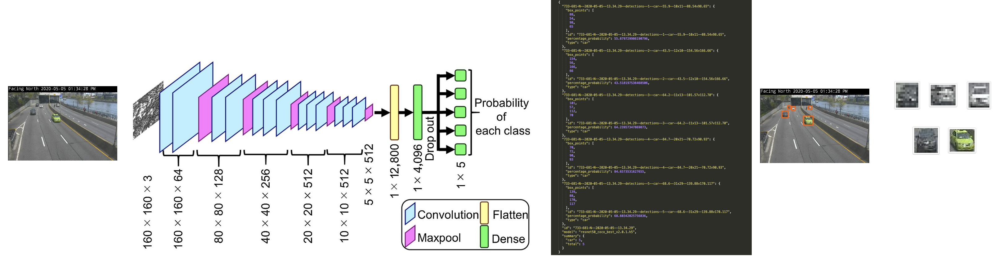
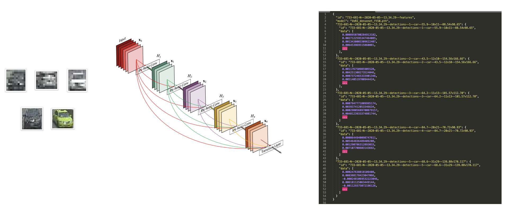
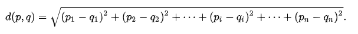
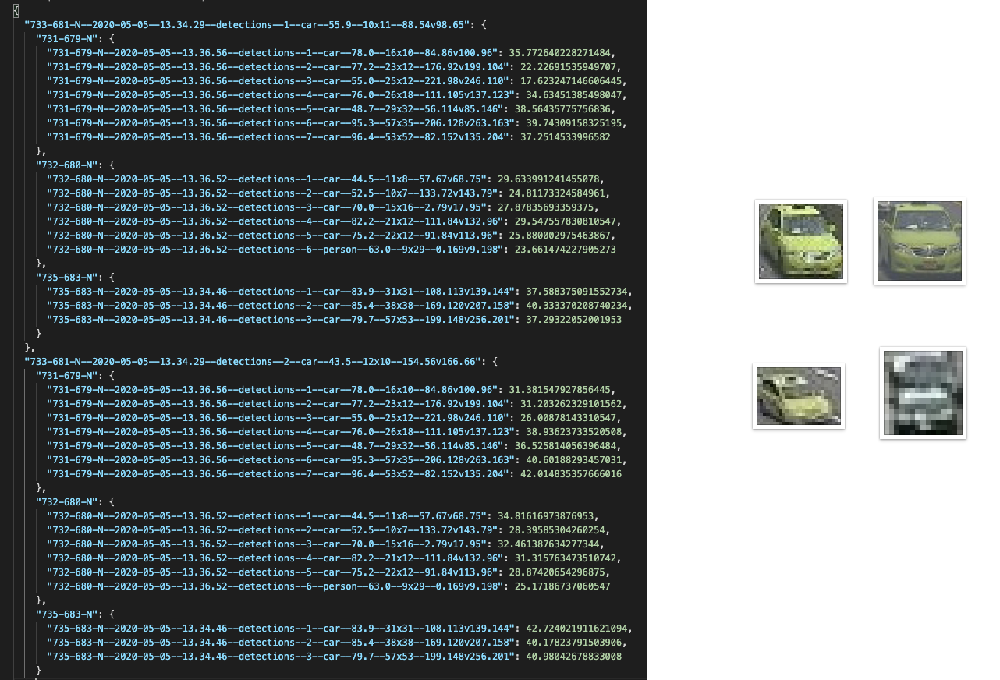

## CCTView Code

CCTView demonstrates implementation of a simple detect, extract, and match algorithm to 
track the movement of a vehicle along a stretch of road. 

<p align="center">
  
</p>

Code and other snippets discussed in the series can be found within this directory. 

The package ``cctview`` is divided into three primary modules
- [``cctview.detect``](./#detect) - Object detection model.
- [``cctview.extract``](./#extract) - VeRI feature extraction model.
- [``cctview.match``](./#match) - MED calculator.

This code is not meant to be installed/imported as a proper library. It's intended to serve
as a minimalist example of the referenced models and techniques.

## Example

After [installing and activating](../#install) the included environment you can run the ``example.py`` script with ``pythonw``.

```
pythonw example.py
```

The script will use the original image files within the ``examples`` directory to run the detect, extract, and match modules.

## Detect

Object detection is implemeted using the ImageAI [``RetinaNet``](https://imageai.readthedocs.io/en/latest/detection/index.html) 
option. The underlying model is loaded with weights from ``models/resnet50_coco_best_v2.0.1.h5`` based on a 50-layer ResNet
trained on the [COCO dataset](http://cocodataset.org/#home).

<p align="center">
  
</p>

Running the method [``detect.run_detector_on_image(input_image_file_path: str)``](https://github.com/samdbrice/cctview/blob/master/code/cctview/detect.py#L24) 
will generate:
 1. A copy of the input image (called ``--detections.jpeg``) with all detected object within their bounding boxes.
 2. An ouput ``--detections.json`` with details about each detected object.
 3. A ``--detections`` directory containing croped images for each detected object.

## Extract

Features from the detected objects (generated output #3 above) are extracted using the second-to-last layer of a 
[DenseNet](https://arxiv.org/abs/1608.06993) CNN. PyTorch is used to load weights from ``models/VeRI_densenet_ft50.pth``
based on a ``Densenet201`` architecture, tuned using the [VeRI dataset](https://github.com/VehicleReId/VeRidataset).
Based on code from the [Track-to-Track ReID method](https://github.com/GeoTrouvetout/Vehicle_ReID) referenced in the series.

<p align="center">
  
</p>

Running the method [``extract.run_extractor_on_dataset(dataset_path: str)``](https://github.com/samdbrice/cctview/blob/master/code/cctview/extract.py#L167) 
will generate:
 1. A consolidated ouput ``--features.json`` with features data for each detected object found within the ``--detections`` directories.

## Match

As discussed in the talk an ideal matching and ReID algorithm would be based on [Track-to-Track ranking](https://github.com/GeoTrouvetout/Vehicle_ReID).
This module demonstrates a rudimentary matching implementation based on the minimal 
[Euclidean distance between two points](https://en.wikipedia.org/wiki/Euclidean_distance#Higher_dimensions). The features extracted above
into ``--features.json`` represent points based on Cartesian coordinates in *n*-dimensional Euclidian space, the distance formula is:

<p align="center">
  
</p>

This matcher calculates distances from all objects within a base frame to all objects within a list of target frames. It also 
groups images for each base object and their candidates into a new directory called ``matches``. See  example output bellow.

<p align="center">
  <br />
  
</p>